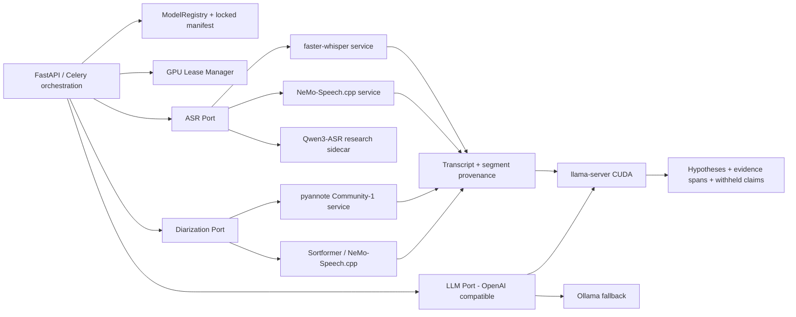

# Research: local AI stack cho SpeechToInfomation

**Ngay danh gia:** 2026-08-09  
**Muc tieu trien khai:** Windows, NVIDIA RTX 4070 SUPER 12 GB, tieng Viet la chinh, co mot phan nho tieng Anh, van hanh air-gapped/offline 100%  
**Pham vi:** ASR/transcript, speaker diarization, summary, structured investigation analysis, inference serving, quantization va dong goi model

## 1. Ket luan dieu hanh

1. **Khong chuyen toan bo sang vLLM tren may dich hien tai.** vLLM van la lua chon tot cho Linux va tai dong thoi cao, nhung tai lieu chinh thuc yeu cau Linux va khong ho tro Windows native. WSL/Docker lam tang do phuc tap van hanh ma khong mang lai loi ich ro rang cho mot GPU 12 GB va workload Celery chu yeu xu ly tuan tu.
2. **Dung `llama-server` CUDA lam LLM serving production; giu Ollama cho development/fallback.** `llama-server` chay native Windows, nap GGUF bang duong dan ro rang, co OpenAI-compatible API, continuous batching, health/metrics va JSON-schema constrained output. Day la phuong an phu hop nhat de dong goi model trong release offline va bat buoc output phan tich dung schema.
3. **Model LLM can trien khai truoc la `Qwen3-8B-GGUF`.** Repo da co dung file official `Qwen3-8B-Q4_K_M.gguf`, SHA-256 khop LFS SHA-256 chinh thuc. Model hien chua duoc dung dung vi adapter doi sai ten file va `llama_cpp_python` hien tai la ban CPU-only (`gpu_offload=False`).
4. **ASR hien tai chua nen bi thay ngay.** `faster-whisper large-v3` dang hoat dong tren GPU va la baseline an toan. Hai challenger hien dai can tai va benchmark tren corpus dieu tra tieng Viet la:
   - `nvidia/nemotron-3.5-asr-streaming-0.6b` Q8 GGUF qua NeMo-Speech.cpp: native Windows/CUDA, artifact 0.742 GB, streaming, word timestamps, tieng Viet o nhom transcription-ready.
   - `nvidia/parakeet-ctc-0.6b-Vietnamese`: 0.6B, huan luyen tren hon 2,000 gio tieng Viet, cong bo WER truc tiep tren nhieu bo du lieu Viet; phu hop ung vien quality batch.
5. **Diarization nen nang tu `speaker-diarization-3.1` len `pyannote/speaker-diarization-community-1`.** Community-1 cai thien speaker counting/assignment, co exclusive diarization de gan timestamp ASR de hon, va ho tro clone day du cho air-gapped. Repo hien chua co weights pyannote thuc su va package `pyannote.audio==3.1.1` da cu so voi dong 4.0.7.
6. **Luong tu hoa la can thiet cho LLM, nhung khong nen ap dung dong loat cho audio.** Dung Q4_K_M cho profile balanced; Q4_K_M 14B hoac Q6_K 8B cho profile quality. ASR/diarization chi luong tu hoa khi benchmark CER/WER/DER va critical-entity recall cho thay khong suy giam nghiep vu.
7. **Khong duoc coi benchmark nha phat hanh la bang chung chat luong dieu tra.** Moi model moi chi duoc promote sau khi dat corpus gate noi bo: CER/WER, ten rieng/so tien/tai khoan/dia chi, timestamp, DER/JER, unsupported-claim rate va prompt-injection resistance.

## 2. Phuong phap RTK va tieu chi co the bac bo

### 2.1 Observation va inference

- **OBS**: du lieu quan sat truc tiep tu repo, runtime, model card hoac tai lieu chinh thuc.
- **INF**: suy luan kien truc/hieu nang; phai duoc benchmark tren may dich truoc khi coi la ket qua.
- **GATE**: dieu kien bat buoc de thay baseline production.

### 2.2 Completion gates

| Gate | Dieu kien pass |
|---|---|
| Offline | Khoi dong va xu ly end-to-end khi chan mang; khong co download ngam; khong can token o runtime |
| Provenance | Moi weight/runtime co model ID, revision, SHA-256, license, URL nguon va ngay tai |
| ASR | Khong giam critical-entity recall; unsupported/hallucinated span khong tang; ung vien phai cai thien CER hoac RTF co y nghia |
| Diarization | DER/JER va speaker-count accuracy khong kem baseline; overlap va timestamp alignment duoc danh gia rieng |
| Summary | Schema valid, du cac diem cot loi, khong bo sung su kien ngoai transcript |
| Analysis | 100% evidence quote phai truy vet duoc ve transcript; unsupported high-risk claim = 0; moi suy luan van mang nhan `unverified` |
| Resource | Khong OOM tren 12 GB VRAM; co gioi han context/concurrency va co model lifecycle ro rang |
| Maintainability | Backend chi phu thuoc vao interface noi bo/OpenAI-compatible API; model va runtime khong bi hard-code rai rac |

## 3. Hien trang thuc te cua repo

### 3.1 Hardware va runtime

| Hang muc | Observation 2026-08-09 | Danh gia |
|---|---|---|
| GPU | NVIDIA GeForce RTX 4070 SUPER, 12,282 MiB, compute capability 8.9, driver 591.86 | Du cho audio model 0.6B-1.55B va LLM 8B/14B da quantize; khong du de giu moi model lon cung luc mot cach an toan |
| faster-whisper | 1.2.1; CTranslate2 4.6.0 | Ban faster-whisper dang la latest release; runtime on dinh |
| PyTorch | 2.1.1+cu121 | Qua cu cho cac stack NeMo/pyannote 4.x hien dai; khong nen upgrade ngay trong venv monolith |
| pyannote.audio | 3.1.1 | Chua phai dong Community-1/4.x hien tai |
| llama_cpp_python | 0.3.16, `llama_supports_gpu_offload() == False` | Adapter llama.cpp trong process hien tai se chay CPU; khong phu hop production |
| vLLM | Khong cai | Khong phai loi hien tai; khong nen chen vao venv Windows chinh |
| Ollama | 0.17.1; latest upstream kiem tra tai ngay danh gia la 0.32.6 | Runtime local dang cu dang ke; nen nang cap co kiem thu neu tiep tuc dung |

### 3.2 Model dang co

| Model/nhom | Observation | Van de |
|---|---|---|
| Whisper cache | `models/whisper` 7.266 GB: large-v3-turbo 1.510 GB, large-v2 2.877 GB, large-v3 2.879 GB | Co du baseline offline ASR; dang ton tai ca model cu va model moi |
| Qwen3-8B GGUF | `models/qwen3/Qwen3-8B-Q4_K_M.gguf`, 5,027,783,488 byte, SHA-256 `d98cdcbd03e17ce47681435b5150e34c1417f50b5c0019dd560e4882c5745785` | Hash khop official `Qwen/Qwen3-8B-GGUF`; adapter lai doi `Qwen_Qwen3-8B-Q4_K_M.gguf`, nen khong tim thay |
| Vistral GGUF | Khong co file ma adapter doi | Khong nen de UI/config tiep tuc coi la model production |
| Pyannote | Khong co `speaker-diarization-3.1` hoac `community-1` trong `models/pyannote` | Runtime thanh cong truoc do phu thuoc cache ben ngoai repo/HF token; chua portable offline |
| Ollama | 18 model, gom llama3.2:3b, qwen2.5 7B/14B, gemma2:9b, deepseek-r1:8b, gpt-oss:20b | Kho model lon, trung lap, khong co manifest/revision/license tap trung; `gpt-oss:20b` 13 GB vuot VRAM vat ly neu muon full GPU |

### 3.3 Bang chung local ve summary/analysis

Artifact: `docs/evals/runs/context-analysis-live-2026-08-09.json`.

| Model | Analysis | Summary | Ket luan dung muc |
|---|---|---|---|
| llama3.2:3b | 3/3 ca synthetic pass, released evidence grounded 100% | Ca duoc chay pass | Chi chung minh runtime/schema gate tren bo smoke nho; chua chung minh chat luong dieu tra |
| gemma2:9b | 0/3 do JSON khong hop le truoc fix `format=json` | Pass smoke | Khong nen lam analysis default neu chua rerun sau fix |
| deepseek-r1:8b | 1/3, latency 14.6-46.8 s | Pass smoke | Qua cham va output cau truc khong on dinh trong baseline |

**OBS:** Khong co human ground truth cho ket qua summary/analysis hien tai.  
**INF:** Qwen3-8B voi schema-constrained decoding co kha nang giai quyet nhom loi JSON va tang chat luong tieng Viet, nhung phai duoc chay lai cung harness truoc khi promote.

## 4. ASR/transcript: candidate matrix

| Ung vien | Bang chung chat luong/chuc nang tu nguon chinh | Artifact/runtime | Offline/Windows | License | Quyet dinh |
|---|---|---|---|---|---|
| faster-whisper `large-v3` | Whisper multilingual manh; faster-whisper cong bo nhanh toi 4x so voi openai-whisper va dung it memory hon. Benchmark large-v2 tren RTX 3070 Ti: FP16 4,525 MB, int8 2,926 MB | Repo da co CTranslate2 2.879 GB; dang chay FP16 | Native Windows/Python/CUDA, da hoat dong | MIT runtime; model Whisper MIT | **Baseline quality hien tai** |
| faster-whisper `large-v3-turbo` | Nhanh hon large-v3; phu hop xu ly khoi luong lon | Repo da co 1.510 GB | Native Windows/Python/CUDA | MIT | **Balanced fallback**, chi promote sau CER/entity test tieng Viet |
| PhoWhisper-large | Fine-tune Whisper tren 844 gio, nhieu giong Viet. Cong bo WER: CMV-Vi 8.14, VIVOS 4.67, VLSP2020-T1 13.75, T2 26.68 | 1.55B; can Transformers hoac convert CTranslate2 | Offline duoc; Windows/PyTorch duoc, nhung them mot stack/model lon | BSD-3-Clause | **Vietnamese quality challenger**, khong mac dinh do ho tro tieng Anh va toc do can do lai |
| NVIDIA Parakeet CTC 0.6B Vietnamese | Huan luyen tren >2,000 gio Viet; native punctuation/capitalization va timestamps. Cong bo blind AVG WER 9.30 (VIVOS 5.96) va in-domain AVG 9.73 | `.nemo` 2.436 GB + LM 0.174 GB; 600M | Offline sau khi tai; NeMo Python phuc tap tren Windows, nen tach service/container hoac thu convert runtime C++ | NVIDIA Open Model License; model card noi san sang commercial/non-commercial | **Ung vien quality batch uu tien cao** |
| NVIDIA Nemotron 3.5 ASR Streaming 0.6B | 40 locale; `vi-VN` transcription-ready; punctuation/capitalization, auto language ID. Tren FLEURS vi-VN, WER LangID tu 13.41 (80 ms) den 11.18 (1.12 s); auto 13.59 den 11.22 | Official Q8 GGUF 741,548,352 byte; SHA-256 `a5c435f294eea8f88ce68dd27b8c3bfea7f777cb2fbba04fcd30eaa555f429ae` | **NeMo-Speech.cpp co native Windows/CUDA**, HTTP/server, batch + realtime, word offsets | OpenMDW-1.1; model card noi ready for commercial use | **Ung vien balanced/streaming chien luoc**; can gate vi moi va runtime chua co stable release |
| Qwen3-ASR 0.6B/1.7B | 30 ngon ngu + 22 phuong ngu, co Vietnamese, offline + streaming, robust audio/BGM. 1.7B duoc nha phat hanh bao cao rat manh; 0.6B toi uu throughput | 0.6B weight 1.876 GB; 1.7B weight 4.699 GB; Transformers hoac vLLM | Offline duoc; vLLM streaming can Linux/WSL; Transformers batch co the tach process | Apache-2.0 | **Research challenger**; khong default vi forced aligner khong ho tro Vietnamese va native timestamp path chua dat yeu cau dieu tra |

### 4.1 Khuyen nghi ASR

**Giai doan on dinh ngay bay gio**

- Giu `faster-whisper large-v3` FP16 lam baseline quality.
- Dung `large-v3-turbo` cho profile speed sau khi no dat CER va critical-entity gate.
- Giam beam tu 10 chi khi benchmark cho thay khong mat ten rieng, chu so, so tien va dia danh; beam=10 hien tai khong tu dong dong nghia voi chat luong nghiep vu tot hon.

**Nang cap can benchmark dau tien**

1. Nemotron 3.5 ASR Q8/NeMo-Speech.cpp: uu tien cho balanced, streaming va package Windows gon.
2. Parakeet CTC Vietnamese: uu tien cho batch quality, noisy phone/audio nghiep vu.
3. PhoWhisper-large: baseline Vietnamese-specialized de tranh ket luan sai rang model moi hon luon tot hon.
4. Qwen3-ASR: chi promote neu giai quyet timestamp Vietnamese va vuot ba ung vien tren.

**Khong ket hop ASR bang cach noi text tu nhieu model.** Neu can ensemble, chi re-decode cac span low-confidence/critical entity va luu ca hai hypothesis kem model/revision/confidence; quyet dinh cuoi phai co human review.

## 5. Speaker diarization: candidate matrix

| Ung vien | Evidence | Diem manh | Han che | Quyet dinh |
|---|---|---|---|---|
| pyannote `speaker-diarization-3.1` | Baseline hien tai; da tung chay thanh cong tu cache ngoai repo | Pho bien, khong phu thuoc ngon ngu cu the | Repo khong co weights; code local loader khong dung snapshot layout; package 3.1.1 cu | Khong coi la offline-production hien tai |
| pyannote `speaker-diarization-community-1` + pyannote.audio 4.0.7 | Official benchmark cho thay cai thien so voi 3.1: AISHELL-4 DER 11.7 vs 12.2; AliMeeting 20.3 vs 24.5; AMI IHM 17.0 vs 18.8. Official changelog co VBx, exclusive diarization va clone offline | Speaker counting/assignment tot hon; exclusive diarization de map voi ASR; artifact weights nho; air-gapped co quy trinh chinh thuc | Gated download/user conditions; can upgrade dependency isolated; van can Vietnamese/noisy-phone DER local | **Production target cho batch investigation** |
| NVIDIA Streaming Sortformer 4spk v2/v2.1 | Cong bo RTF 0.002-0.180 tren RTX 6000 Ada tuy latency; co DER benchmark; NeMo-Speech.cpp convert thanh GGUF va co the tra word speaker tags | Streaming, overlap-aware, tich hop truc tiep native ASR pipeline; checkpoint `.nemo` 471 MB | Toi da 4 speaker; model card noi train chu yeu tieng Anh va co the giam tren non-English/noise | **Streaming challenger**, khong thay community-1 truoc DER Viet |
| SimpleVAD/k-means fallback hien tai | Chay offline khi pyannote hong | Khong bi block runtime | Khong phai diarization tin cay cho evidence; speaker labels co the sai co he thong | Chi la degraded mode, phai hien canh bao ro |

### 5.1 Khuyen nghi diarization

- Batch/forensic: `community-1`, regular + exclusive diarization, luu RTTM/segments va model provenance.
- Realtime/balanced: thu `Sortformer v2.1` trong NeMo-Speech.cpp; hard cap 4 speaker phai la metadata/canh bao, khong duoc am tham gan nham.
- Khong quantize pyannote truoc. Weights khong phai nut that lon; DER va speaker assignment quan trong hon phan VRAM tiet kiem duoc.

## 6. LLM cho summary va structured investigation analysis

| Model | Vietnamese/quality evidence | Kich thuoc/thich hop 12 GB | Structured output | License | Quyet dinh |
|---|---|---|---|---|---|
| llama3.2:3b (Ollama) | Local smoke analysis 3/3 pass; model nho, nhanh | 2.0 GB local | Da pass gate hien tai sau validation noi bo | Llama community license | **Runtime fallback**, khong phai quality winner |
| Qwen3-8B official GGUF | 100+ language/dialect, thinking va non-thinking, 32K native context | Q4_K_M 5.028 GB; Q5_K_M 5.851 GB; Q6_K 6.726 GB | llama.cpp ho tro JSON schema; Qwen co non-thinking mode | Apache-2.0 | **Balanced production target** |
| Qwen3-14B official GGUF | Cung ho Qwen3, nang luc cao hon 8B theo quy mo nhung phai xac minh task-specific | Q4_K_M 9.002 GB; vua 12 GB neu context/concurrency bi gioi han va audio model duoc unload | JSON schema qua llama.cpp | Apache-2.0 | **Quality profile target** |
| Qwen3.5-9B | 201 ngon ngu/dialect, 9B, 262K native context, thinking mac dinh; official card cong bo nang luc multilingual/reasoning cao hon the he Qwen3 | BF16 khong vua 12 GB; khong co official Qwen GGUF trong ket qua API HF ngay danh gia; community GGUF co supply-chain risk | vLLM/SGLang ho tro official weights; llama.cpp b10331 co reasoning off va can GGUF tu convert co provenance | Apache-2.0 | **Strongest quality challenger cho host nay**, chi promote sau benchmark Viet noisy-ASR va quantization A/B |
| gpt-oss-20b | Reasoning, function calling, structured outputs; official MXFP4 | Official noi can 16 GB memory; local Ollama blob 13 GB, khong full-fit VRAM 12 GB | Tot tren ly thuyet, can Harmony format | Apache-2.0 | Khong phu hop default tren GPU nay; chi hybrid CPU/GPU quality experiment |
| gemma2:9b / deepseek-r1:8b | Local baseline co loi structured JSON va/hoac cham | 5.2-5.4 GB local | Chua dat harness gate truoc fix | Gemma license / model-specific | Khong chon lam default moi |

### 6.1 Tach task, khong tach model tuy tien

Dung chung mot Qwen3 checkpoint de giam VRAM va storage, nhung tach ro hai policy:

| Task | Mode | Decoding | Output gate |
|---|---|---|---|
| Summary | Non-thinking | temperature 0.1-0.3, context chunk/map-reduce khi can | Khong them su kien; co coverage va source segment IDs |
| Investigation analysis | Non-thinking mac dinh; reasoning chi bat trong sandbox eval | temperature 0; JSON schema bat buoc | Evidence quote/span bat buoc; high-risk claim bi withheld; risk=`unverified` |

**INF:** Thinking mode khong mac dinh tot hon cho extraction. No tang latency, token noi bo va nguy co output lang man. Structured investigation analysis can deterministic constrained decoding + post-validation hon la chain-of-thought dai. Qwen3.5 chi dung `reasoning_effort=none`/`--reasoning off` trong production extraction; reasoning mode chi la ablation co budget va khong duoc phat hanh chain-of-thought.

## 7. Ollama, llama.cpp hay vLLM?

| Engine | Windows | 12 GB/single GPU | Offline packaging | Structured output/ops | Danh gia |
|---|---|---|---|---|---|
| Ollama | Native, ho tro NVIDIA; API tai 11434 | Tot cho dev/single user | Co `OLLAMA_MODELS`, import GGUF; blob store kho audit hon file model truc tiep | JSON schema co ho tro; van hanh don gian | Giu dev/fallback; upgrade co kiem thu tu 0.17.1; khong lam source of truth cua model |
| llama-server CUDA | Native Windows; official Windows command/build | Rat phu hop GGUF 8B/14B, GPU/CPU hybrid neu can | Duong dan model, runtime binary va config deu pin/hash duoc | OpenAI API, JSON schema/grammar, continuous batching, health, slots, Prometheus | **Lua chon production cho summary/analysis** |
| vLLM | Official OS=Linux; Windows phai WSL/community fork | Manh khi concurrency cao; overhead va KV cache can duoc can chinh | Safetensors/AWQ/GPTQ va container pin duoc | Throughput/continuous batching rat manh | Khong chon cho host hien tai; chi dung sidecar Linux neu workload tang hoac Qwen3-ASR streaming bat buoc |
| llama_cpp_python hien tai | Windows nhung build hien tai CPU-only | Khong tan dung GPU | File ro rang | In-process de crash/leak anh huong worker | Loai khoi production path; co the giu test adapter |

### 7.1 Tai sao tai lieu vLLM cu trong repo khong du lam quyet dinh

`docs/VLLM_SUMMARY.md` ghi cac so nhu 24x throughput, 2-3x latency, 50-60% memory va 5-6x nhanh hon nhung khong co benchmark command, model, prompt, context, GPU hay artifact. Cac claim nay khong dat RTK evidence gate va khong duoc dung de chon kien truc.

## 8. Chien luoc quantization

| Thanh phan | Balanced | Quality | Ly do |
|---|---|---|---|
| Qwen3-8B LLM | Q4_K_M | Q6_K hoac Q5_K_M | Q4 tiet kiem VRAM; Q5/Q6 giu chi tiet tot hon cho extraction nhay cam |
| Qwen3-14B LLM | Khong dung | Q4_K_M, context 8K-12K, concurrency 1 | File 9.002 GB; can danh VRAM cho KV/runtime |
| faster-whisper | FP16 truoc; `int8_float16` chi khi can co-load | FP16 | Official benchmark cho thay int8 giam VRAM, nhung khong co bang chung CER Viet trong repo |
| Nemotron 3.5 ASR | Official Q8_0 GGUF | Q8_0; BF16 chi benchmark | Q8 la portable default chinh thuc, artifact 0.742 GB |
| Parakeet/PhoWhisper | Khong quantize o vong dau | FP16/BF16 | Can giu baseline chat luong de biet quantization gay suy giam bao nhieu |
| Pyannote Community-1 | Khong | Khong | Tiet kiem khong dang doi lay rui ro DER |
| Sortformer | Q8 chi sau A/B voi F32/F16 | F16/F32 | Model card canh bao domain/ngon ngu; quantization la bien thu nghiem rieng |

**GATE cho quantization:** tren cung model/revision, quantized candidate chi pass neu critical-entity recall khong giam qua 0.5 diem phan tram, unsupported span khong tang, va CER/DER khong kem hon nguong confidence interval da dinh.

## 9. Hai profile de xuat

### 9.1 `balanced-local` - de xuat mac dinh sau khi benchmark

| Stage | Target | Fallback production trong luc chua dat gate |
|---|---|---|
| ASR | Nemotron 3.5 ASR 0.6B Q8 qua NeMo-Speech.cpp, `vi-VN`, chunk 560 ms hoac 1.12 s cho file; 160-320 ms cho realtime | faster-whisper large-v3-turbo hoac large-v3 FP16 |
| Diarization | pyannote Community-1 cho file batch; Sortformer v2.1 cho realtime <=4 speakers | pyannote 3.1 neu da dong goi dung, khong dung SimpleVAD nhu ket qua chinh |
| Summary + analysis | Qwen3-8B Q4_K_M, llama-server CUDA, context 8K, parallel=1, schema-constrained JSON | llama3.2:3b Ollama |
| GPU policy | Model lease; khong de Celery worker tu nap model; ASR/diarization/LLM co service owner duy nhat | Queue concurrency 1 neu chua co scheduler |

### 9.2 `quality-investigation` - xu ly batch uu tien do tin cay

| Stage | Target |
|---|---|
| ASR pass 1 | faster-whisper large-v3 FP16 hoac Parakeet CTC Vietnamese, model winner duoc chon bang corpus gate |
| ASR pass 2 | Re-decode chi cac span low-confidence/critical entity bang model thu hai; luu ca hai hypotheses va provenance |
| Diarization | pyannote Community-1, regular + exclusive diarization; human correction UI cho speaker mapping |
| LLM | Qwen3-14B Q4_K_M, llama-server CUDA, context 8K-12K, concurrency=1; chunk theo evidence segments |
| Release gate | Khong phat hanh criminal intent, identity linkage, guilt, risk level neu khong co evidence span va human verification |

## 10. Kien truc dich de sach va de nang cap



### 10.1 Pattern bat buoc

- **Ports and adapters:** nghiep vu khong import truc tiep faster-whisper, pyannote, Ollama hay llama_cpp.
- **Model registry:** mot source of truth cho task -> model -> runtime -> artifact -> revision -> license.
- **Process isolation:** moi runtime lon co process/service rieng; Celery chi orchestration, khong nhan ban model theo so worker.
- **GPU lease/state machine:** `UNLOADED -> LOADING -> READY -> BUSY -> EVICTING`; co timeout, health, VRAM budget va queue priority.
- **Evidence-first schema:** moi entity/event/relationship/hypothesis co `source_segment_ids`, quote, time range, model/revision va validation state.
- **Fail closed:** neu model/schema/provenance loi, task phai `failed/degraded`; khong thay bang ket luan regex ma UI khong canh bao.

### 10.2 Duong trich xuat toi uu cho summary/analysis

Khong map-reduce van ban tho mot cach may moc va khong goi LLM rieng cho summary,
analysis, visualization neu chung dung cung facts. Duong dich la:

1. Chia transcript theo speaker turn/time window, giu `segment_id`, timestamp va audio hash.
2. Mot structured extraction pass tao atomic facts/entities/events/relationships kem evidence quote.
3. Validator deterministic loai quote khong ton tai, role reversal, reported speech va high-risk claim khong du can cu.
4. Hop nhat vao fact ledger; deduplicate theo entity/event canonicalization.
5. Reasoning pass chi nhan condensed ledger va evidence lien quan, khong nhan lai toan transcript neu khong can.
6. Summary va Analysis la hai projection dung chung released claim set; visualization la deterministic projection, khong them LLM call.

Kien truc nay giam token/prefill va so lan load/generate, dong thoi ngan hai tab
dua ra hai su that mau thuan. Prompt caching/prefix reuse chi la toi uu bo sung;
khong thay the ledger va chunking co provenance.

## 11. To chuc artifact offline

De dap ung "luu trong repo" ma khong lam Git history hong, weights phai nam trong cay thu muc repo/release bundle, con Git chi track manifest, license, scripts va small metadata. Neu bat buoc version weights bang Git, dung Git LFS noi bo va kiem tra gioi han file.

```text
models/
  manifest.lock.json
  licenses/
    apache-2.0.txt
    bsd-3-clause.txt
    cc-by-4.0.txt
    nvidia-open-model-license.txt
    openmdw-1.1.txt
  asr/
    faster-whisper-large-v3-ct2/<revision>/...
    faster-whisper-large-v3-turbo-ct2/<revision>/...
    nemotron-3.5-asr-streaming-0.6b/<revision>/model.q8_0.gguf
    parakeet-ctc-0.6b-vietnamese/<revision>/model.nemo
  diarization/
    pyannote-community-1/<revision>/config.yaml
    pyannote-community-1/<revision>/segmentation/...
    pyannote-community-1/<revision>/embedding/...
    sortformer-4spk-v2.1/<revision>/model.gguf
  llm/
    qwen3-8b/<revision>/Qwen3-8B-Q4_K_M.gguf
    qwen3-14b/<revision>/Qwen3-14B-Q4_K_M.gguf
  runtimes/
    llama.cpp/<release>/windows-cuda/...
    nemo-speech.cpp/<commit>/windows-cuda/...
```

Moi entry manifest toi thieu:

```json
{
  "artifact_id": "llm.qwen3-8b.q4_k_m",
  "task": ["summary", "investigation_analysis"],
  "source": "https://huggingface.co/Qwen/Qwen3-8B-GGUF",
  "revision": "7c41481f57cb95916b40956ab2f0b139b296d974",
  "relative_path": "models/llm/qwen3-8b/7c41481/Qwen3-8B-Q4_K_M.gguf",
  "sha256": "d98cdcbd03e17ce47681435b5150e34c1417f50b5c0019dd560e4882c5745785",
  "bytes": 5027783488,
  "license": "Apache-2.0",
  "runtime": "llama.cpp-b10331-cuda-windows",
  "network_required": false
}
```

### 11.1 Artifact thuc te da dong goi va verify

| Artifact | Bang chung 2026-08-09 |
|---|---|
| llama.cpp | `b10331`, commit `7ba604f1c`, Windows x64 CUDA 12.4, 11 file duoc verify, 1,767,834,013 byte; probe nhan RTX 4070 SUPER |
| Qwen3-8B Q4_K_M | GGUF 5,027,783,488 byte, SHA-256 `d98cdcbd03e17ce47681435b5150e34c1417f50b5c0019dd560e4882c5745785`, revision `7c41481f57cb95916b40956ab2f0b139b296d974` |
| Startup | `scripts/start_llama_server.ps1`: offline, loopback-only, alias pin, context 8192, parallel 1, Q8 KV, Flash Attention, reasoning off, metrics, idle sleep 2 giay |
| Application adapter | OpenAI-compatible client tach khoi Celery model process; chi chap nhan loopback khi `OFFLINE_STRICT`, tat environment proxy/redirect, bind alias + `/props.model_path`, structured `response_format`, seed pin, TTFT/token telemetry, reject empty/truncated SSE |
| Prompt/runtime optimization | Investigation summary tai su dung context narrative de giam 2 LLM call xuong 1; adaptive sparse prompt giam tu 6,200 ky tu/118 dong xuong 1,498 ky tu/24 dong (giam 75.8%) trong probe cung transcript sentinel; schema duoc gui qua grammar thay vi chen sieu template vao context |
| Runbook | `docs/runbooks/local-llm-llama-server.md` |
| Source snapshot | `docs/evals/runs/local-llm-source-snapshot-2026-08-09.json` pin revision model/docs va tach ro observation voi claim chua benchmark |

Hai harness run `summary-runtime-preflight-2026-08-09.json` va
`summary-runtime-controlled-smoke-2026-08-09.json` dung dung fail-closed voi
`BLOCKED_BY_RESOURCE`: Qwen3.5 can 7,825 MiB, Qwen3 can 6,331 MiB, trong khi
chi con 3,826-3,844 MiB vi worker hien tai dang giu GPU. Lan refresh llama-server
preflight sau hardening con 2,660 MiB va fail `LLAMA_SERVER_UNAVAILABLE` +
`MODEL_NOT_LOADED`; khong model nao bi goi,
nen khong co so lieu chat luong/toc do gia tao.

O D: chi con xap xi 2.23 GB tai lan kiem tra; khong du de tai them Qwen3.5-9B
official weights hoac tao F16 GGUF. Can giai phong/move artifact co audit truoc
khi download/convert challenger; khong duoc tai tiep vao release tree hien tai.

### 11.2 Air-gapped validation

1. Tai artifact tai may staging va verify SHA-256.
2. Copy ca license/model card/revision metadata.
3. Build release bundle co manifest SHA-256 rieng.
4. Tren may sach, dat `HF_HUB_OFFLINE=1`, `TRANSFORMERS_OFFLINE=1`; khong cau hinh HF token.
5. Chan outbound network va chay model preflight + mot audio fixture + summary + analysis.
6. Fail neu co file duoc tao trong user cache ngoai root da khai bao hoac co network attempt.

## 12. Benchmark de quyet dinh model winner

### 12.1 Corpus

- It nhat 100 doan 15-120 giay; tach nhom clean, dien thoai, nen on, xa mic, nhieu vung mien, noi nhanh, noi chong, code-switch Viet-Anh.
- Co nhan chinh xac cho ho ten, biet danh, dia chi, dia danh, thoi gian, so tien, tai khoan, bien so, so dien thoai va cau phu dinh.
- Co 10-20 file dai 10-60 phut de do memory leak, long-form repetition va timestamp drift.
- Khong dung transcript sinh boi model lam ground truth cuoi; can double annotation va adjudication.

### 12.2 Metrics

| Task | Metrics bat buoc |
|---|---|
| ASR | CER, WER, normalized WER, critical-entity precision/recall/F1, hallucinated-span rate, timestamp MAE, RTF, peak VRAM/RAM |
| Diarization | DER, JER, speaker-count accuracy, overlap recall, speaker-attributed WER |
| Summary | fact coverage, contradiction/unsupported rate, entity/amount/time recall, compression ratio, latency |
| Analysis | schema-valid rate, evidence-grounding rate, unsupported high-risk claims, withheld count, prompt-injection pass rate, human usefulness score |

### 12.3 Promotion rule

- Candidate khong duoc replace baseline neu critical-entity recall kem baseline qua 0.5 diem phan tram.
- De justify migration, candidate phai cai thien it nhat mot trong hai: CER giam >=5% tuong doi hoac end-to-end RTF giam >=25%, trong khi khong giam safety/provenance gates.
- LLM analysis phai co unsupported high-risk claim = 0 tren toan bo release set; schema valid >=99.5% sau mot retry co gioi han.
- Moi so lieu phai kem model hash, runtime version, params, device, audio set revision va raw result JSONL.

## 13. Lo trinh ap dung

### Phase A - Sua duong chay model da co, rui ro thap

1. **Da lam:** Qwen3 doc artifact qua manifest va startup script dung filename da verify.
2. **Da lam:** loai direct `llama_cpp_python` khoi summary path; dong goi `llama-server.exe` CUDA va OpenAI-compatible client.
3. **Da lam:** JSON schema, non-thinking/reasoning off, seed pin va telemetry; adaptive sparse extraction loai prompt sieu template va moi item nghiep vu phai co evidence quote.
4. **Da lam mot phan:** runtime/Qwen3 co manifest/checksum/license; Whisper manifest van la task tiep theo.
5. **Da harden nhung chua live gate:** loopback-only/no-proxy/no-redirect, alias/path binding, strict SSE, investigation fail-closed, idle sleep va doi `/props.is_sleeping` trong GPU lease.
6. **Con thieu gate:** controlled live benchmark khi GPU du VRAM; phai do startup/sleep/wake, VRAM release va human-labelled Vietnamese noisy-ASR quality.

### Phase B - Hoan thanh offline diarization

1. Tao env/service pyannote 4.0.7 rieng.
2. Accept license o staging, clone `community-1` theo revision, bo token khoi production runtime.
3. Sua loader theo local path that va chay network-denied test.
4. Benchmark DER/JER/noisy-phone Vietnamese.

### Phase C - ASR challenger bake-off

1. Tai/pin Nemotron 3.5 Q8, build pin NeMo-Speech.cpp Windows CUDA.
2. Tai/pin Parakeet Vietnamese va PhoWhisper-large.
3. Chay cung corpus/cung normalization; khong so sanh WER khac dataset.
4. Promote balanced va quality winner rieng.

### Phase D - Product hardening

1. GPU lease manager va model lifecycle.
2. Offline release builder + manifest verification.
3. Long-run soak, crash recovery, queue backpressure, health/metrics.
4. Human review UI cho transcript/speaker/evidence/hypothesis.

## 14. Residual uncertainty

- Chua co corpus ground truth dieu tra tieng Viet cua du an, nen **khong the ket luan model ASR nao chinh xac nhat**.
- WER cong bo cua PhoWhisper, Parakeet, Nemotron va Qwen3-ASR dung dataset/normalization khac nhau; khong duoc xep hang truc tiep bang cac so nay.
- Peak VRAM va toc do cua Nemotron/Parakeet/Qwen3-14B tren RTX 4070 SUPER chua duoc do; kich thuoc artifact khong bang VRAM runtime.
- NeMo-Speech.cpp rat moi va chua co stable GitHub release tai ngay danh gia; can pin commit, build reproducible va soak test truoc product.
- Pyannote Community-1 can chap nhan user conditions; bo phan phap ly/trien khai can luu bang chung chap nhan va CC-BY-4.0 attribution.
- Qwen3.5-9B la strongest challenger nhung official Qwen GGUF khong co trong HF API ngay danh gia; community quantization khong du provenance de dua thang vao product. Can tu convert official revision va A/B Q4_K_M/Q5_K_M tren corpus Viet.
- Native llama-server adapter da co unit test nhung live CUDA request chua chay vi worker dang giu GPU; day la uncertainty thuc, khong duoc suy ra tu bundle probe.
- Local LLM eval hien chi co 8 synthetic case; can bo release set lon va human-labeled truoc bat ky claim chat luong nghiep vu nao.

## 15. Nguon chinh thuc da kiem tra

Tat ca URL duoc truy cap ngay 2026-08-09.

1. faster-whisper README/benchmark: https://github.com/SYSTRAN/faster-whisper
2. PhoWhisper official repository va WER table: https://github.com/VinAIResearch/PhoWhisper
3. NVIDIA Parakeet Vietnamese model card: https://huggingface.co/nvidia/parakeet-ctc-0.6b-Vietnamese
4. NVIDIA Nemotron 3.5 ASR model card: https://huggingface.co/nvidia/nemotron-3.5-asr-streaming-0.6b
5. NVIDIA NeMo-Speech.cpp: https://github.com/NVIDIA/NeMo-Speech.cpp
6. Qwen3-ASR official model card: https://huggingface.co/Qwen/Qwen3-ASR-0.6B
7. Qwen3-ASR official repository: https://github.com/QwenLM/Qwen3-ASR
8. pyannote.audio README va Community-1 benchmark: https://github.com/pyannote/pyannote-audio
9. pyannote.audio 4.0 changelog/offline cloning: https://github.com/pyannote/pyannote-audio/blob/main/CHANGELOG.md
10. NVIDIA Streaming Sortformer model card: https://huggingface.co/nvidia/diar_streaming_sortformer_4spk-v2
11. Qwen3-8B model card: https://huggingface.co/Qwen/Qwen3-8B
12. Qwen3-8B official GGUF files: https://huggingface.co/Qwen/Qwen3-8B-GGUF
13. Qwen3-14B official GGUF files: https://huggingface.co/Qwen/Qwen3-14B-GGUF
14. Qwen3.5-9B model card: https://huggingface.co/Qwen/Qwen3.5-9B
15. OpenAI gpt-oss-20b model card: https://huggingface.co/openai/gpt-oss-20b
16. llama.cpp main repository: https://github.com/ggml-org/llama.cpp
17. llama.cpp server/OpenAI API/JSON schema: https://github.com/ggml-org/llama.cpp/blob/master/tools/server/README.md
18. Ollama Windows documentation: https://docs.ollama.com/windows
19. Ollama structured outputs: https://docs.ollama.com/capabilities/structured-outputs
20. vLLM installation/platform requirements: https://docs.vllm.ai/en/latest/getting_started/installation/gpu.html
21. llama.cpp pinned Windows CUDA release b10331: https://github.com/ggml-org/llama.cpp/releases/tag/b10331
22. Hugging Face model API search used to verify no official `Qwen/Qwen3.5-9B-GGUF` result: https://huggingface.co/api/models?author=Qwen&search=Qwen3.5-9B
